# CampusApp - Smart Campus Health and Safety Notification System

**CampusApp** is a cross-platform mobile application developed with **Flutter** and **Firebase**, designed to centralize and manage campus-wide incidents, emergency announcements, and technical issues in real-time. This project was developed as a term project for the Mobile Programming course at **Ataturk University**.

## Overview

The system provides a centralized digital platform to enhance communication and safety within university campuses. It allows students and staff to report various incidents (security, health, technical failures, etc.) with location-based data, while enabling administrators to oversee and resolve these reports efficiently.

## ✨ Key Features

* 
**Role-Based Access Control:** Distinct interfaces and permissions for **Users** and **Admins**.

* 
**Real-time Incident Reporting:** Users can create notifications including title, description, category, and precise location.

* 
**Interactive Map Integration:** Visualization of all campus incidents on an interactive map using **Google Maps SDK**.

* 
**Emergency Broadcasting:** Dedicated module for Admins to push high-priority emergency alerts to all users.

* 
**Dynamic Notification Tracking:** Users can follow specific incidents and receive real-time updates when the status (e.g., Pending → Resolved) changes.

* 
**Advanced Filtering & Search:** Efficient search and category-based filtering to prevent information clutter.

## 🛠 Tech Stack

* 
**Framework:** Flutter (Dart).

* 
**Backend as a Service (BaaS):** Firebase.

* 
**Authentication:** Secure institutional email login and session management.

* 
**Cloud Firestore:** Real-time NoSQL database for incident and user data.

* 
**State Management:** Provider (MVVM Architecture).

* 
**Location Services:** Google Maps API & Geolocator.

##  Architecture (MVVM)

The project follows professional software engineering principles by implementing the **Model-View-ViewModel (MVVM)** design pattern:

1. 
**Model:** Defines the data structures (e.g., `NotificationModel`, `UserModel`).

2. 
**View:** Contains UI widgets and handles user interaction without business logic.

3. 
**ViewModel (Provider):** Manages the business logic, state updates, and communicates with Firebase.

4. 
**Service:** Dedicated layer for direct Firebase interactions (Auth & Firestore services).

## 📸 Screen Samples

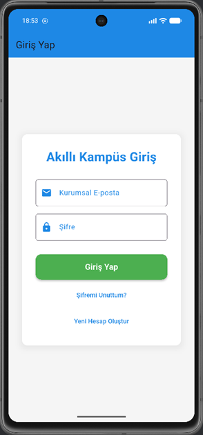 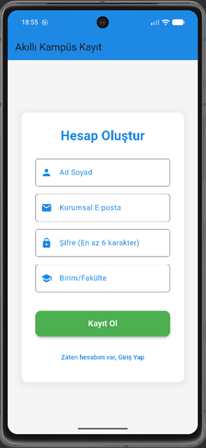 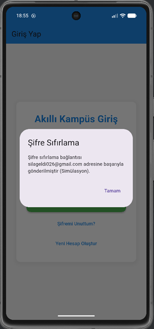 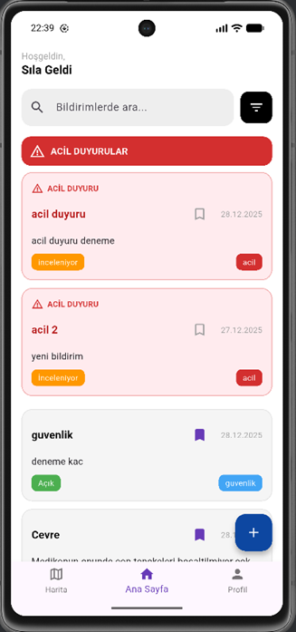 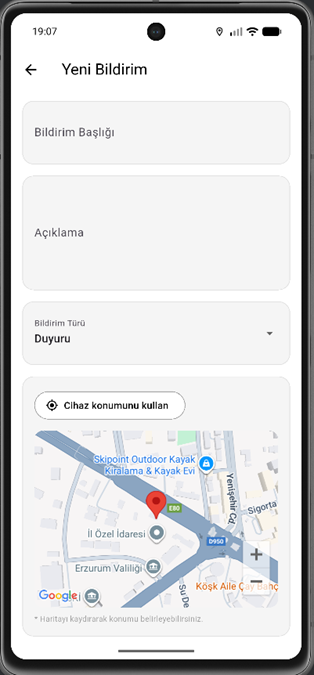 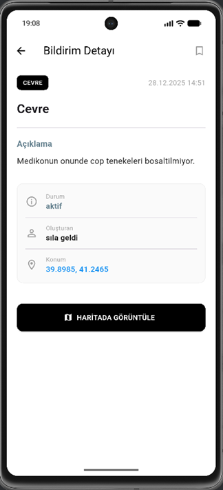 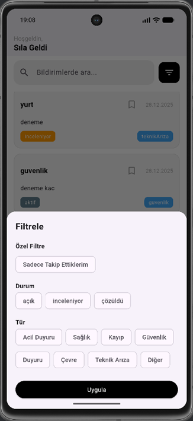 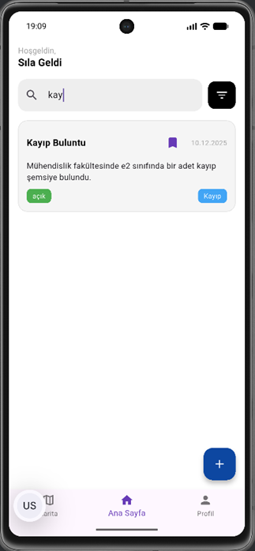 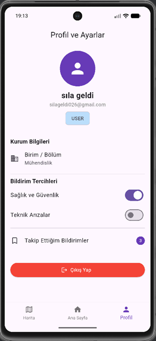 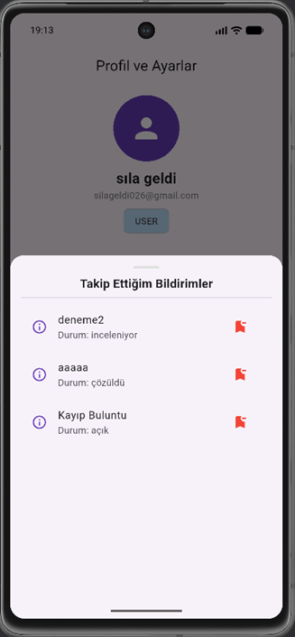 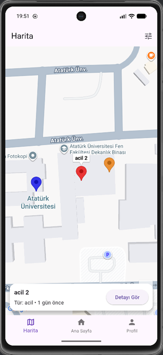 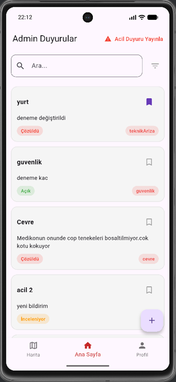 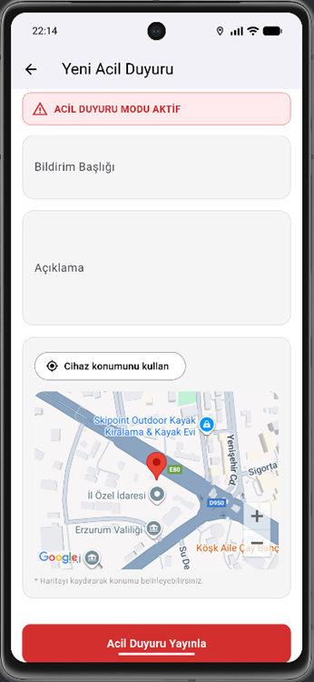 

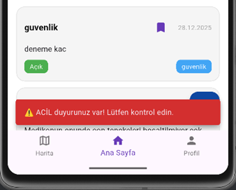  
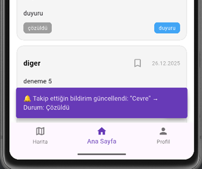

## 👥 Project Team

* [**Sıla Geldi**](https://github.com/SilaGeldi)
* [**Cansu Güzel**](https://github.com/cansuguzel)
* [**Beyza Karakoç**](https://github.com/BeyzaKarakoc2)

